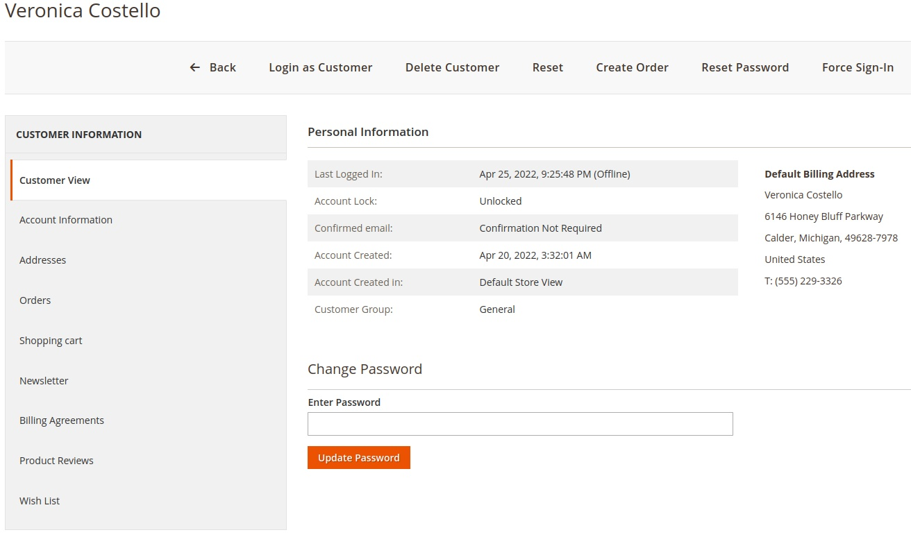

# Change Customer Password In Admin - Magento 2

    composer require ghoster/changecustomerpassword

Change Customer Password In Admin Magento 2 module is implements the form in customer edit which allow admin change
customer password directly like old-fashion way Magento 1.

[](https://packagist.org/packages/ghoster/changecustomerpassword)
[](https://packagist.org/packages/ghoster/changecustomerpassword)
[](https://packagist.org/packages/ghoster/changecustomerpassword)
[](https://packagist.org/packages/ghoster/changecustomerpassword)
[](https://packagist.org/packages/ghoster/changecustomerpassword)
[](https://www.codacy.com/gh/tuyennn/magento2-change-customer-password/dashboard?utm_source=github.com&amp;utm_medium=referral&amp;utm_content=tuyennn/magento2-change-customer-password&amp;utm_campaign=Badge_Grade)
[](https://www.paypal.me/thinghost)
[](https://app.travis-ci.com/github/tuyennn/magento2-change-customer-password)


---

- [Extension on GitHub](https://github.com/tuyennn/magento2-change-customer-password)
- [Direct download link](https://github.com/tuyennn/magento2-change-customer-password/tarball/master)



## Main Features

* Add a quick update Password button to customer view in Admin

## Command-line usage

Call the console command and pass the customers email address and the new password.

```bash
bin/magento customer:change-password test@example.com password123
```

If customer accounts are not shared between websites, a website code has to be specified with the `--website` or `-w`
option.

```bash
bin/magento customer:change-password --website base test@example.com password123
```

## Installation with Composer

* Connect to your server with SSH
* Navigation to your project and run these commands

```bash
composer require ghoster/changecustomerpassword


php bin/magento setup:upgrade
rm -rf pub/static/* 
rm -rf var/*

php bin/magento setup:static-content:deploy
```

## Installation without Composer

* Download the files from
  github: [Direct download link](https://github.com/tuyennn/magento2-change-customer-password/tarball/master)
* Extract archive and copy all directories to app/code/GhoSter/ChangeCustomerPassword
* Go to project home directory and execute these commands

```bash
php bin/magento setup:upgrade
rm -rf pub/static/* 
rm -rf var/*

php bin/magento setup:static-content:deploy
```

## Licence

[Open Software License (OSL 3.0)](http://opensource.org/licenses/osl-3.0.php)

## Donation

If this project help you reduce time to develop, you can give me a cup of coffee :)

[](https://www.paypal.me/thinghost)
